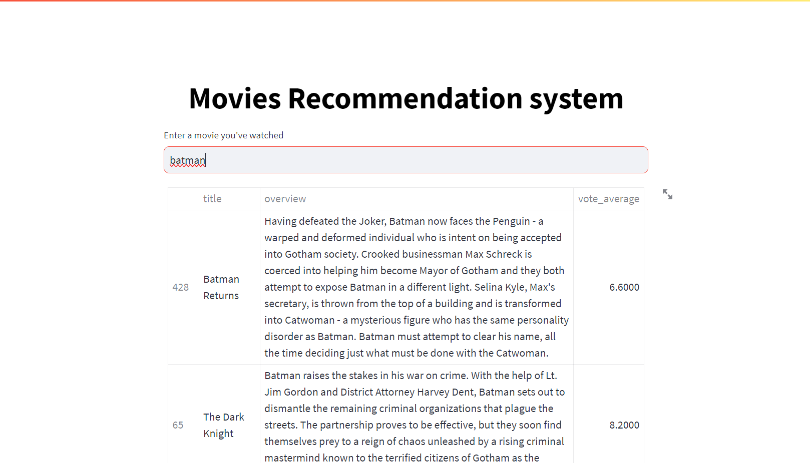

# Movie Recommendation System

## Overview

The Movie Recommendation System is a powerful tool that leverages Natural Language Processing (NLP) to provide personalized movie recommendations. In the age of data and information, this system harnesses the wealth of movie-related data to enhance the user experience in discovering new and exciting films.

### Features

- Predicts user preferences and ratings for movies.
- Improves search results by suggesting highly relevant movies.
- Recommends movies based on user history and preferences.
- Enhances the quality of movie recommendations through advanced NLP techniques.

## Datasets

This project utilizes two main datasets:

1. **Movie Information Dataset**
   - `movie_id`: A unique identifier for each movie.
   - `cast`: Names of lead and supporting actors.
   - `crew`: Names of the director, editor, composer, writer, etc.

2. **Movie Details Dataset**
   - `budget`: The budget of the movie.
   - `genre`: The genre of the movie (e.g., Action, Comedy, Thriller).
   - `homepage`: Link to the movie's homepage.
   - `keywords`: Keywords or tags related to the movie.
   - `original_language`: The language in which the movie was made.
   - `original_title`: The original title of the movie.
   - `overview`: A brief description of the movie.
   - `popularity`: Numeric quantity specifying the movie's popularity.
   - `production_companies`: Production house of the movie.
   - `production_countries`: The country where it was produced.
   - `release_date`: Release date of the movie.
   - `revenue`: Worldwide revenue generated by the movie.
   - `runtime`: Running time of the movie in minutes.
   - `status`: "Released" or "Rumored."
   - `tagline`: Movie's tagline.
   - `title`: Title of the movie.
   - `vote_average`: Average ratings received by the movie.
   - `vote_count`: The count of votes received.

## Getting Started

To get started with the Movie Recommendation System, follow these steps:

1. Clone this repository to your local machine.
2. Install the required dependencies (list them in a `requirements.txt` file).
3. Run the system using the provided scripts or instructions.

## Demo

[Link website](https://movies-recommendation-system-h.streamlit.app/)

## Contributors

- [Amine jari](https://github.com/jramine)

## License

This project is licensed under the MIT License - see the [LICENSE](LICENSE) file for details.
